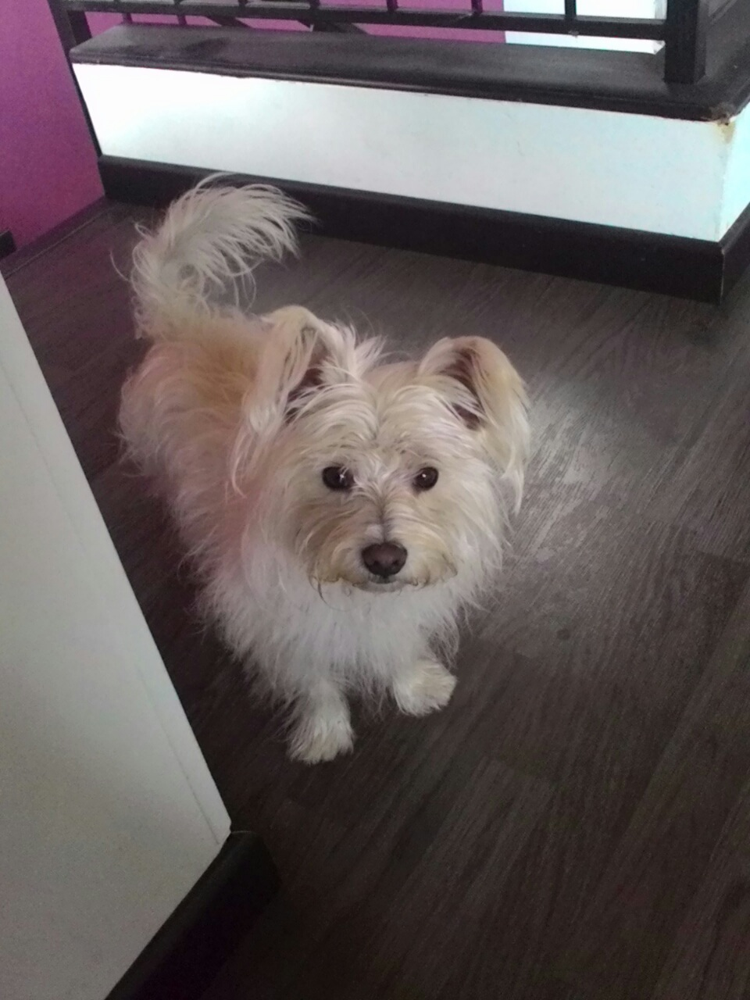
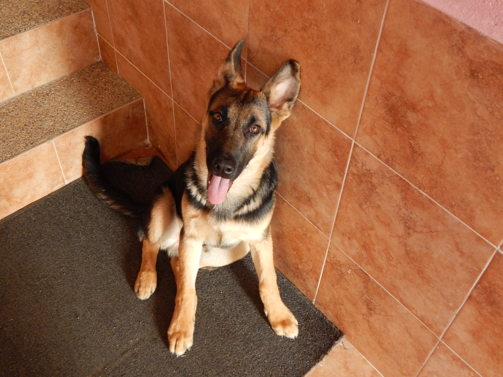
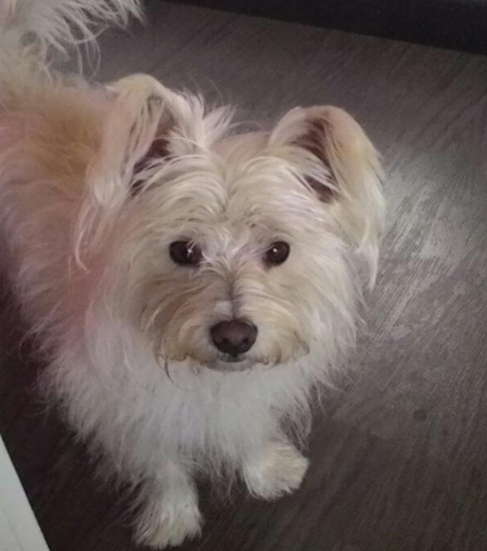
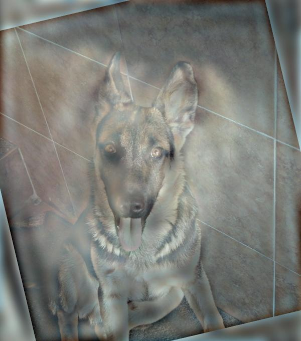
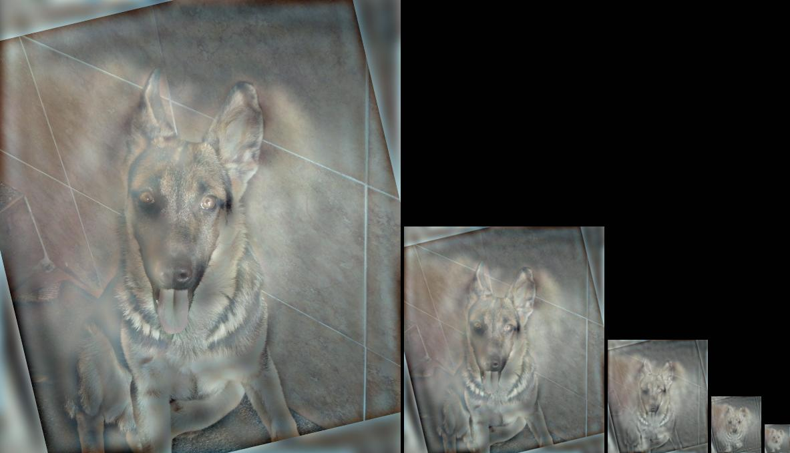

###Original images
These are the original images selected for this laboratory:
<table>
<tr>
<td>
	
</td>
<td>
	
</td>
</tr>
</table>

The selected images are of two puppies: a West Highland Terrier (left) and a German Shepperd (right). The first picture was taken by the author, while the second was taken by a relative. 
 
The hardware used to make the pictures is very different. The picture of the terrier was made with a low resolution CCD sensor on an Asus note 7 tablet and the second was made with a CMOS sensor on a Nikon L820 camera. The resolution is very different; The original terrier picture has a resolution of 960x1280 pixels (2 Mpx), the  shepherd picture has an original resolution of 4608x3456 (16 Mpx). It is also worth noticing that the orientation of the original images is portrait (terrier) and landscape (shepperd).

###Image Transformation
Images were carefuly selected so that the position, size and orientation of the dogs faces are similar already, yet some simple operations had to be made to better align the images. 
First, as the image of the german shepherd is at a much higher resolution, it is rescaled so that both have the same height.
Second, images are cropped to 600x680 size. The main goal of this cropping operation is to keep the eyes of the dogs close to the center of the image.
Third, the  image of the shepherd is rotated 12 degrees to the left to better align the eyes and noses of the dogs
These are the resulting images

<table>
<tr>
<td>
	
</td>
<td>
	
</td>
</tr>
</table>
Its is worth noticing that the shapes of the heads are slightly different. The sheppard has a thinner, slightly longer face, while the (proportionaly) broader face of the terrier looks even wider due to the long fur. No preprocessing is applied to adress this features as it will highly distort other elements in the image, furthermore the eyes and the ears already have a fair correspondence

###Hybrid Image
The obtained hybrid image is the following:  

###Pyramid Image
When the pyramid is built, clearly the larger images resemble the picture of the shepper, while the smaller resemble the original picture of the terrier.  It is interesting that, while the alignment of the body of the dogs is completely different (the shepherd is sitting while the terrier is standing), the body of the shepherd is almost completely contained in the long hair of the terrier, thus it almost completely disappears at low resolutions. 
 

### Color
Finally the color of the images seems to also blend properly according to the resolution. The final (smallest) image seems to be predominantly white as is the fur of the terrier. The first image is light brown, which apparently does not completely match the color of the shepherd, however the more the first image is zoomed in, the closer the color resemblance is. That is the shepherd color looks closer the original brow and black.

