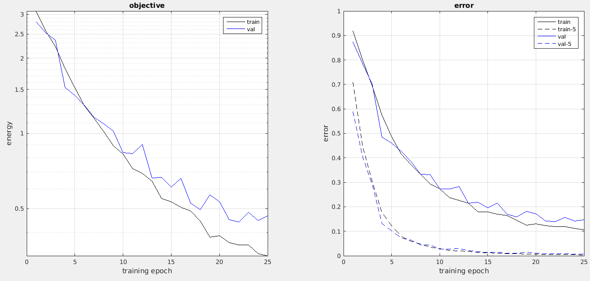

### CNN architecture
The base idea for the first attempts at the network initialization was to explicitly include the textons filters (Leung & Malik) into a network with similar structure  to the character CNN provided with the code base.  This proved to be inefficient and ineffective regardless of the orientation and scale of the texton filters.

A follow up work tried to use the very same Digit network to classify the textons, again with very poor results. A deeper version (1, 2 and 3 convolutional layers deeper) of the Digit network was also implemented, again with very poor results. 

The final approach was then to build a very somewhat deep network (6 convolutional layers) with a very different architecture to those mentioned before i.e smaller random filters. This network performed surprisingly better than the initial approaches. The final CNN is as follows:

Type Layer| Filter Size | Stride 
-----|--------------|-----------
Conv |3x3x32|1
Relu||
Conv |3x3x32|1
Max Pool |2x2|2
Conv |3x3x64|1
Relu||
Conv |3x3x64|1
Max Pool |2x2|2
Max Pool |2x2|2
Conv |3x3x128|1
Relu||
Conv |3x3x128|1
Max Pool |2x2|2
Conv |1x1x25|1

### Results
Figure 1 shows the error and  Top5 error during a training process limited to 35 minutes in a Nvidia Tesla K40 

On the epoch 25 of the trainig process an error of 14.7% for a single category, and an error for the top 5 categories of 5 0.7% is achieved.Best results are achieve for the following parameters

Batch Size:180

Learning Rate:0.001

####Ablation Tests  (Some insight into why It works)
It is hard to formally explain why this network performs well on the texture recognition problem, however, ablation tests can shed some light on the more relevant elements of the network.

Alñ test start from the same basic experimental setup:
Initial Network: as described above
Learning Rate: 0.001
Dataset: As provided from the instructors, 12500 images for train, 12500 images for validation
Max 10 epoch for training.
All images were rescaled to 64x64.

Convolutional Layer ablation (Notice the final layer,conv 7, is never removed, as it is always required to have a final layer to transform the output of the network into a 1x25 array)

Layers Removed| Error | Error Top5
-----|--------------|-----------|-------
Conv 2,3,4,5,6|96.1%|79.9%
Conv 3,4,5,6| 96.1%|79.9%
Conv 4,5,6|69.7%|33.4%
Conv 5,6|45.3%|12.8%
Conv 6| 32.5% |4.6%
Full| 27.3%|2.7%

With the small filters (3x3) network depth is critical as it increases the area of the original image anñaysed by filters in the final layers. The performance of the network declines quickly with each filter removed and can't learn if 4 or more convolutional layers are removed.

Deeper networks were tested with a slight decrease in the error rate, however, these networks are too big to be quickly trained in smaller GPUs, so the 7 layer version is considered as final for this laboratory.

####Training set preprocessing 
The initial division for the training and validation set was 50%-50% (12500-12500) images each. An additional preprocessing of the images included the data type conversion (From Uint8 to Single) in order to work with the GPU library and the rescaling to 64x64 in order to save some GPU time and memory. 

####Additional Changes
The initial texton database contains only samples for the training test, to correct this, the samples are assigned to the validation set by a by a random process according only to the desired final number in samples in the validation set.

After a review of the provided code, it was identified that the original jitter function could create training instances which contain at least 2 (probably 3) different textures in the image, this problem was addressed in the posted jittering function.

